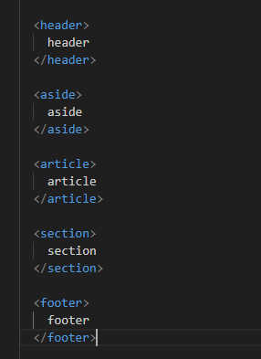

# Display Grid

Normalmente temos o conteiner pai, que definirá o layout todo do projeto, lá podemos definir a quantidade de colunas e linhas que a tela terá de um modo geral. Os itens dentro desse container herda alguns estilos, podendo também ter suas proprias divisões e interações.&#x20;

### Columns (<mark style="color:yellow;">grid-tamplete-columns</mark>)

podemos definir as colunas com a propriedade <mark style="color:yellow;">grid-tamplete-columns</mark>, onde definimos a quantidade de colunas e o tamanho.

Usando o <mark style="color:yellow;">**auto**</mark>, podemos definir colunas que preencham todo os espaço disponivel de acordo com a quantidade de colunas, ou seja, ela será responsiva. Mas também podemos mesclar, podendo criar colunas com tamanho auto ou com tamanho definido(<mark style="color:yellow;">**pixels, rem, em**</mark>):

Abaixo definimos 3 colunas com tamanho auto

<div data-full-width="true">

<figure><figcaption></figcaption></figure>

</div>

O que resultou em:

<figure><figcaption></figcaption></figure>

usando medidas, podemos mesclar:

<figure><figcaption></figcaption></figure>

Resultado

<figure><figcaption></figcaption></figure>


### Rows(<mark style="color:yellow;">grid-tamplate-rows</mark>)

o <mark style="color:yellow;">grid-tamplate-rows</mark> definirá os tamanhos das linhas, nao a quantidade. Podendo realizar variações de tamanho, veja:

<figure><figcaption></figcaption></figure>

Resultado:

<figure><figcaption></figcaption></figure>


### Propriedade <mark style="color:yellow;">FR</mark>(fração)

Essa propriedade pode der usada tanto no <mark style="color:yellow;">grid-tamplete-rows</mark> quanto no <mark style="color:yellow;">grid-tamplete-columns</mark>. Basicamente ela referencia uma fração da tela, entao podemos definir de maneira organizada como a tela será dividida. O legal é que ela é responsiva, então ela preenche todo o espaçi disponivel e se adequa as telas, entao nao precisa se preocupar, além disso, ela é melhor que o <mark style="color:orange;">auto</mark> por que podemos definir a fração de qualquer maneira. Veja:

<figure><figcaption></figcaption></figure>

Resultado:

<figure><figcaption></figcaption></figure>


### Propriedade Repeat

Uma maniera de otimizar a criação de colunas ou tamanho de linhas é usar a propriedade repeat, pois nela podemos definir a quantida e o tamanho. Sintaxe:

```css
repeat(quantidade, tamanho)
```

Veja:

<figure><figcaption></figcaption></figure>

Definimos 4 colunas com 200px cada:\


<figure><figcaption></figcaption></figure>
