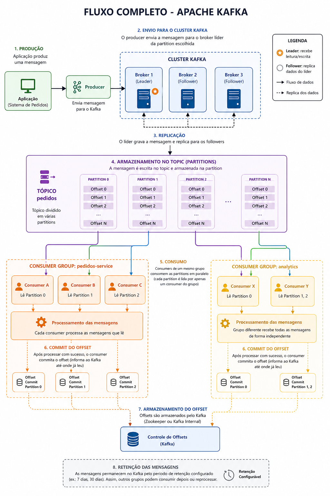

# Mensageria Kafka

Kafka é uma plataforma de mensageria distribuída usada para transmitir grandes volumes de eventos entre sistemas de forma rápida, escalável e confiável.

## Principais componentes

### Producer

É quem **envia** mensagens para o Kafka.

### Topic

É onde as mensagens ficam armazenadas.

Pode ser imaginado como uma "fila" ou "canal". Cada tipo de evento geralmente possui seu próprio tópico.

### Consumer

É quem lê as mensagens.

Pode existir um ou vários consumidores lendo o mesmo tópico. Todos recebem a mesma informação.

### Broker

O Broker é o servidor Kafka.

Ele é responsável por:

* armazenar mensagens;
* receber mensagens dos Producers;
* entregar mensagens aos Consumers;
* replicar dados;
* manter tudo funcionando.

Um cluster Kafka normalmente possui vários Brokers. Isso garante alta disponibilidade.

### Exemplo do fluxo

```
Cliente faz compra
        │
        ▼
Sistema de Pedidos
        │
        ▼
Producer
        │
        ▼
Kafka Broker
        │
        ▼
Topic pedidos
        │
        ▼
Partition 0
        │
        ▼
Mensagem gravada
        │
        ▼
Consumer Group
        │
 ┌──────┴────────┐
 ▼               ▼
Estoque      Nota Fiscal
 │               │
 ▼               ▼
Processa      Processa
 │               │
 ▼               ▼
Commit Offset  Commit Offset
```


<figure><figcaption></figcaption></figure>

***

### O que é um Offset?

Cada mensagem dentro de uma partition recebe um número sequencial. O offset funciona como um **marcador de posição**. Quando o consumer lê o evento, ele commita(sinaliza)  ao Kakfa Broker para marcar a ultima posição da leitura.  Sendo assim, o kafka sabe até onde processou pelo **commit do offset.**

```
Exemplo:

Partition 0

Offset 0 → Pedido 101
Offset 1 → Pedido 102
Offset 2 → Pedido 103
Offset 3 → Pedido 104
```

***

### O que é o Commit?

Quando o Consumer termina de processar uma mensagem com sucesso, ele envia uma confirmação ao Kafka. O Kafka salva essa informação.

***

#### Commit automático (`EnableAutoCommit = true`)

O próprio Kafka confirma periodicamente os offsets lidos, sem que a aplicação precise fazer isso.

**Vantagens:**

* Simples de implementar.
* Menos código.

**Desvantagem:**

* Pode perder mensagens. Se o offset for confirmado antes do processamento terminar e a aplicação falhar, ao reiniciar ela continuará do próximo offset, ignorando a mensagem que não foi processada.

***

#### Commit manual (`EnableAutoCommit = false`)

A aplicação decide quando confirmar o offset. Normalmente, ela faz o commit **somente após processar a mensagem com sucesso**.

Fluxo:

**Vantagens:**

* Maior confiabilidade.
* Se ocorrer um erro antes do commit, a mensagem será consumida novamente quando o consumidor voltar.

**Desvantagem:**

* Exige mais controle por parte da aplicação.
